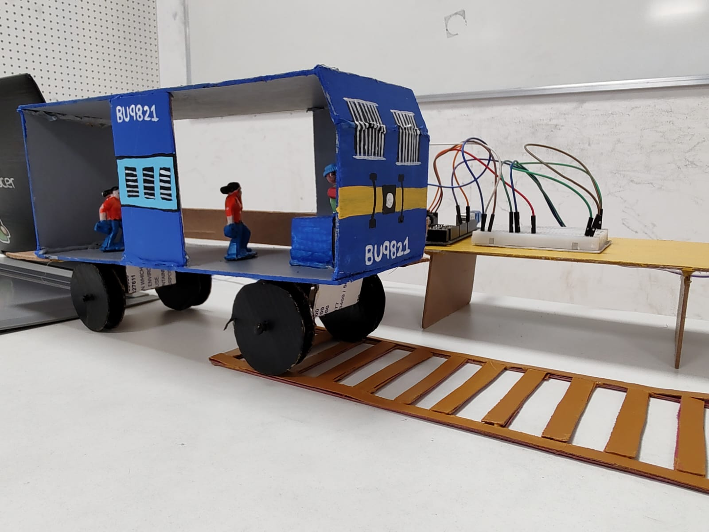
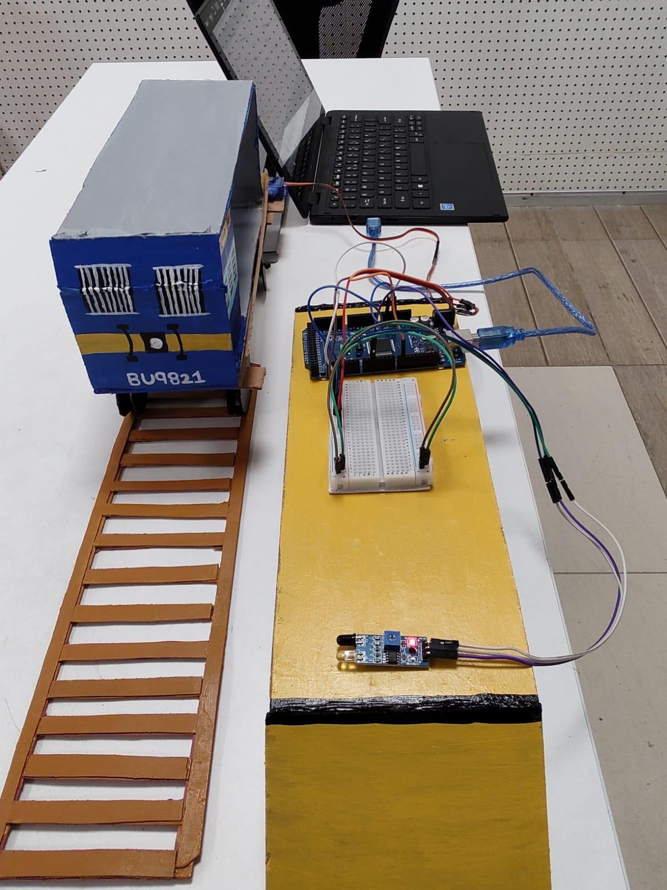

# Rakshik
<h2>A Railway Platform Gap Filler</h2>
<h4>Platform Gap Fillers are mounted in plate along all the coaches to reduce the gap between the platform and the train; ensuring that when a train has stopped at a, platform, passengers are able to enter and exit with safety.</h4>

  
  

<h2>Code for the project: <a href='https://github.com/BeginnerCoder21/PlatformGapFiller'>Link</a></h2>
